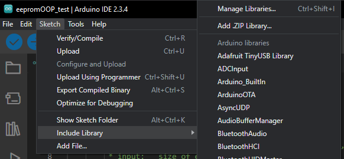

# picoEEPROM library for Arduino-Pico boards
This library was created to simplify the process of saving data into an EEPROM for boards from [Arduino-Pico by earlephilhower](https://github.com/earlephilhower/arduino-pico). This library WILL NOT WORK with any other boards!

# Instalation
There are two ways to install this library:
1. Download this repository as .zip and include it using Arduino IDE (Sketch>>Include Library>>Add .ZIP Library...)

2. **NOT POSSIBLE YET** Add this library from Arduino IDE's library menager by typing *picoEEPROM* and selecting *picoEEPROM by Glinek* 

# Documentation
This library is based on EEPROM.h library from Arduino-Pico, max allowed EEPROM size 4096 bytes, in this documentation each byte is going to be refared as address because we need to specify at which byte we will save the data.

## Initializing library
At the beggining of your Arduino program you need to initialize this library and create an object e.g.:
```cpp
#include <picoEEPROM.h>
picoEEPROM picoEEPROM;
```

## Functions
### Begin function
#### begin(eeprom_size)
`begin` function, takes one argument - size of eeprom, max allowed size is 4096. `begin` function returns 0 if everything worked and 1 if eeprom size is invalid. E.g.
```cpp
picoEEPROM.begin(4096); //begin eeprom with it's max allowed size
```

### putEmptyByte/putEmptyBytes functions
Those function serve as a way to clear a single byte or multiple bytes.
#### putEmptyByte(address)
`putEmptyByte` puts one empty byte at a specified address
```cpp
picoEEPROM.putEmptyByte(0);
``` 
#### putEmptyBytes(num_of_bytes, address)
`putEmptyBytes` takes two arguments, number of empty bytes and starting address. It puts specified number of empty bytes starting at a given address.
```cpp
picoEEPROM.putEmptyBytes(7, 1);
```

### Int values
Those functions are used to store intiger value and retrive it from eeprom.
#### putInt(value, address)
`putInt` takes two arguments, intiger value and EEPROM address. Important! this function takes 4 bytes/4 EEPROM addresses to store one intiger starting at a given address. `putInt` returns 1 if value is out of range, 2 if commiting to eeprom failed and 0 if everything worked.
```cpp
picoEEPROM.putInt(555, 0); //puts int = 555 starting at address 0
```
#### getInt(address)
`getInt()` takes one argument, EEPROM address (the same address as in `putInt`). This function returns int read from EEPROM. If something is wrong with retrived int check if correct address is specified.
```cpp
int valueRead = picoEEPROM.getInt(0); //reads int from address 0
```

### Bool values
Those functions are used to store boolean values in EEPROM. Because of the fact that picoEEPROM uses bytes, in each byte you can store up to 8 boolean values (8 bits) to save space in EEPROM.
#### putBool(value, bit, address)
`putBool` takes three arguments, boolean value, bit at which value will be stored and EEPROM address. This function returns 1 if bit is not between 0-7, 2 if commiting to eeprom failed and 0 if everything worked,
```cpp
picoEEPROM.putBool(true, 0, 5); //saving false at bit 0 at EEPROM address 5
```
#### getBool(bit, address)
`getBool` takes 2 arguments, bit at which value is stored and EEPROM address. This function returns boolean value read from EEPROM.
```cpp
bool boolRead = picoEEPROM.getBool(0, 5); //reads bool from bit 0 at EEPROM address 5
```

### String values
Those functions are used to store strign values in EEPROM. Because of the way they are coded strigns should be composed of only ASCI charasters from 0 to 255, otherwise something will not work. This library has 2 functions for working with strings. First one takes string of a static size of 20 bytes and second one takes every string smaller that 4096.
#### putString20(value, address)
`putString20` takes two arguments, string value and EEPROM address. This function will always take 20 bytes from EEPROM to save given string even if it's e.g. 4 characters long. Keep this in mind when alocating addresses. This function returns 1 if string is larger than 20, 2 if commiting to EEPROM failed and 0 if everything worked.
```cpp
picoEEPROM.putString20("testingStuff", 6); //puts string starting at address 6
```
#### getString20(address)
`getString20` takes one argument, EEPROM address and returns string read starting at that address.
```cpp
String firstStringRead = picoEEPROM.getString20(6); //reads string stored at addresses 6 to 26
```

#### putString(value, address)
`putString` takes 2 arguments, string of any value smaller than 4096 bytes and EEPROM address. This function returns 1 if string is larger than 4096, 2 if commiting to EEPROM failed and **String's length!** if everything worked. This data can be used with getString function.
```cpp
int stringLength = picoEEPROM.putString("this string is longer than 20 characters", 27) //puts string starting at address 27
```
#### getString(string_size, address)
`getString` takes 2 arguments, string length and EEPROM address. String length is returned when saving given string to eeprom using `putString` function. This function returns string read from EEPROM.
```cpp
String secondStringRead = picoEEPROM.getString(stringLength, 27); //reads string stored at addresses 27 to 27+stringLength
```

# License
# Author